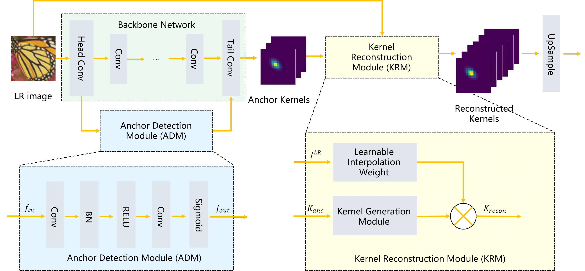

# An Efficient Blur Kernel Estimation Method for Blind Image Super-Resolution



## Requirements
- Python 3.7, PyTorch >= 1.6.0, scipy >= 1.6.3 
- Requirements: opencv-python
- Platforms: Ubuntu 16.04, cuda-10.0 & cuDNN v-7.5

Note: this repository is based on [MANet](https://github.com/JingyunLiang/MANet). Please refer to their repository for a better understanding of the code framework.

## Data Preparation
To prepare data, put training and testing sets in `./datasets` as `./datasets/DIV2K/HR/0801.png`. Commonly used datasets can be downloaded [here](https://github.com/xinntao/BasicSR/blob/master/docs/DatasetPreparation.md#common-image-sr-datasets).


## Training

Step1: to train ADKR, run this command:

```bash
python train.py --opt options/train/train_stage1.yml
```

Step2: to train non-blind RRDB, run this command:

```bash
python train.py --opt options/train/train_stage2.yml
```

Step3: to fine-tune RRDB with ADKR, run this command:

```bash
python train.py --opt options/train/train_stage3.yml
```

A sample model (scale 4 noise 0) is listed under pretrained_models. The test trained models will be released soon.

## Testing

To test ADKR (stage1, kernel estimation only), run this command:

```bash
python test.py --opt options/test/test_stage1.yml
```
To test RRDB-SFT (stage2, non-blind SR with ground-truth kernel), run this command:

```bash
python test.py --opt options/test/test_stage2.yml
```
To test MANet+ADKR (stage3, blind SR), run this command:

```bash
python test.py --opt options/test/test_stage3.yml
```
Note: above commands generate LR images on-the-fly. To generate testing sets used in the paper, run this command:
```bash
python prepare_testset.py --opt options/test/prepare_testset.yml
```


